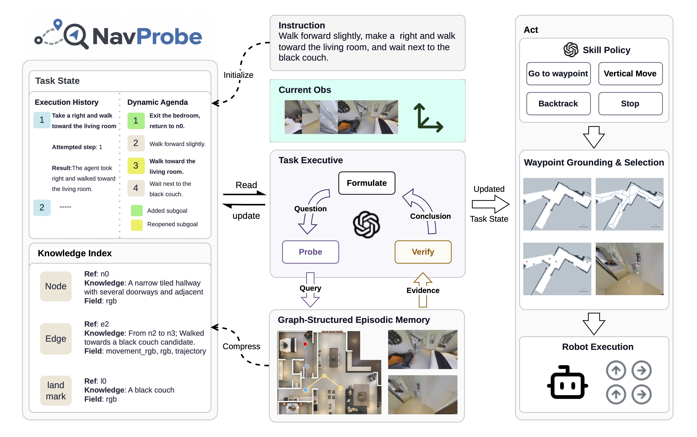

<h1 align="center">NavProbe: Evidence-Grounded Reasoning with Active Memory Retrieval for Zero-Shot Navigation</h1>

<h3 align="center">
  <a href="https://github.com/liujy25">Jingyang Liu</a>,
  Sujia Yao,
  <a href="https://jiayuan-gu.github.io/">Jiayuan Gu</a>,
  <a href="http://xu-lan.com/">Lan Xu</a>
</h3>

<p align="center">
  <a href="https://arxiv.org/abs/2609.27526v1"></a>
  <a href="LICENSE"></a>
</p>

<p align="center">
  
</p>

## Overview

Long-horizon navigation requires an agent to revise its intermediate objectives as evidence accumulates. Full visual histories are costly to process, while compact summaries may omit details needed to reconsider earlier decisions. We introduce NavProbe, a hierarchical zero-shot navigation agent that couples a dynamic subgoal agenda with active evidence retrieval. A compact index links summaries of visited places, transitions, and landmarks to their visual and geometric records. When the current context is insufficient, a task executive retrieves targeted evidence to generate, revise, or resolve subgoals. Reusable conclusions are used to update the index, and a skill policy converts the revised task state into parameterized navigation actions. NavProbe achieves 71.7% SR and 55.8% SPL on R2R-CE and 55.3% SR and 38.6% SPL on RxR-CE, outperforming strong zero-shot baselines. It also achieves 79.3% SR on HM3D-v2 ObjectNav, with qualitative real-robot demonstrations illustrating physical deployment.

## Installation

Use Python 3.9 and Habitat 0.3.3.

```bash
git clone https://github.com/liujy25/NavProbe.git
cd NavProbe

conda create -n navprobe python=3.9
conda activate navprobe
conda install habitat-sim=0.3.3 headless -c conda-forge -c aihabitat
pip install 'git+https://github.com/facebookresearch/habitat-lab.git@a9c8df586d649972e55500a0fbaae1952b1c3483#subdirectory=habitat-lab'
pip install -e '.[llm,habitat,detectors]'
```

Prepare the detector selected in [navprobe.yaml](navprobe/config/navprobe.yaml):

- **GroundingDINO** (default): follow its [installation instructions](https://github.com/IDEA-Research/GroundingDINO#install) and place the Swin-T weights at `weights/groundingdino_swint_ogc.pth`.
- **YOLO-World**: set `landmark_perception.detector: yolo_world`, place the weights at `weights/yolov8x-world.pt`, and install CLIP:

  ```bash
  pip install 'git+https://github.com/ultralytics/CLIP.git@a13192f8cb767260d7dfd98c843b0716593169e7'
  ```

Check the Habitat installation with `python scripts/smoke_test_habitat.py --check-install`.

## Data preparation

The included [Uni-LaViRA](https://github.com/NJU-R-L-Group-Embodied-Lab/uni-lavira-code) [episode lists](navprobe/data/benchmarks) contain 100 episodes per dataset. Download task data and scenes to the paths below, relative to the repository root.

### Task data

Extract the [VLN-CE](https://github.com/jacobkrantz/VLN-CE#data) and [Habitat-Lab](https://github.com/facebookresearch/habitat-lab/blob/main/DATASETS.md#task-datasets) task archives as follows:

| Download | Resulting directory |
| --- | --- |
| [R2R-CE episodes](https://drive.google.com/file/d/1T9SjqZWyR2PCLSXYkFckfDeIs6Un0Rjm/view) | `data/datasets/R2R_VLNCE_v1-3/` |
| [R2R-CE preprocessed data (required for nDTW)](https://drive.google.com/file/d/1fo8F4NKgZDH-bPSdVU3cONAkt5EW-tyr/view) | `data/datasets/R2R_VLNCE_v1-3_preprocessed/` |
| [RxR-CE episodes and nDTW ground truth](https://drive.google.com/file/d/145xzLjxBaNTbVgBfQ8e9EsBAV8W-SM0t/view) | `data/datasets/RxR_VLNCE_v0/` |
| [HM3D-v2 ObjectNav episodes](https://dl.fbaipublicfiles.com/habitat/data/datasets/objectnav/hm3d/v2/objectnav_hm3d_v2.zip) | `data/datasets/objectnav/hm3d/objectnav_hm3d_v2/` |

Keep the complete HM3D `val/content/` directory. R2R nDTW uses the neighboring preprocessed directory.

### Scene assets

**R2R / RxR — Matterport3D:** request access on the [Matterport3D website](https://niessner.github.io/Matterport/). Use the provided `download_mp.py` with `--task habitat` to download the Habitat scene archive (the upstream downloader uses Python 2.7). Extract it so each scene is at `data/scene_datasets/mp3d/<scene>/<scene>.glb`.

**HM3D-v2 — HM3D-Semantics v0.2:** obtain access and an API token via the [HM3D website](https://aihabitat.org/datasets/hm3d/), then download the validation scenes with Habitat-Sim:

```bash
python -m habitat_sim.utils.datasets_download \
  --username "YOUR_MATTERPORT_TOKEN_ID" --password "YOUR_MATTERPORT_TOKEN_SECRET" \
  --uids hm3d_val_v0.2 --data-path data/
ln -s hm3d data/scene_datasets/hm3d_v0.2
```

<details>
<summary>Expected data directory structure</summary>

```text
data/
├── datasets/
│   ├── R2R_VLNCE_v1-3/val_unseen/val_unseen.json.gz
│   ├── R2R_VLNCE_v1-3_preprocessed/val_unseen/val_unseen_gt.json.gz
│   ├── RxR_VLNCE_v0/val_unseen/
│   │   ├── val_unseen_guide.json.gz
│   │   └── val_unseen_guide_gt.json.gz
│   └── objectnav/hm3d/objectnav_hm3d_v2/val/
│       ├── val.json.gz
│       └── content/<scene>.json.gz
└── scene_datasets/
    ├── mp3d/<scene>/
    │   ├── <scene>.glb
    │   └── <scene>.navmesh
    └── hm3d_v0.2/
        ├── hm3d_annotated_basis.scene_dataset_config.json
        └── val/<scene-directory>/
            ├── <scene>.basis.glb
            ├── <scene>.basis.navmesh
            ├── <scene>.semantic.glb
            └── <scene>.semantic.txt
```

</details>

For other data locations, set `dataset.data_path` and `dataset.scenes_dir` in [r2r.yaml](navprobe/config/datasets/r2r.yaml), [rxr.yaml](navprobe/config/datasets/rxr.yaml), or [hm3dv2.yaml](navprobe/config/datasets/hm3dv2.yaml).

## Run

Set `model.name`, `model.base_url` and detector settings in [navprobe.yaml](navprobe/config/navprobe.yaml). Use a vision-capable model with an OpenAI-compatible API.

Use `--config` and `--dataset-config` to select custom algorithm and dataset YAML files.

```bash
export NAVPROBE_API_KEY="your-api-key"

python scripts/run_vlnce_agent.py --dataset r2r
python scripts/run_vlnce_agent.py --dataset rxr
python scripts/run_hm3d_agent_batch.py --dataset hm3dv2
```

Each command runs the episode list and automatically skips completed episodes with matching settings.

Logs and results are saved under `runs/<dataset>/`. Set `output.record_dir`, `output.results_dir` and `output.visualize` in the dataset YAML to configure outputs.

## Citation

```bibtex
@misc{liu2026navprobe,
  title={NavProbe: Evidence-Grounded Reasoning with Active Memory Retrieval for Zero-Shot Navigation},
  author={Jingyang Liu and Sujia Yao and Jiayuan Gu and Lan Xu},
  year={2026},
  eprint={2609.27526},
  archivePrefix={arXiv},
  primaryClass={cs.RO},
  url={https://arxiv.org/abs/2609.27526}
}
```

## Acknowledgements

We thank [Uni-LaViRA](https://github.com/NJU-R-L-Group-Embodied-Lab/uni-lavira-code), [MSGNav](https://github.com/ylwhxht/MSGNav), [VLFM](https://github.com/rai-opensource/vlfm) and [frontier_exploration](https://github.com/naokiyokoyama/frontier_exploration) for their open-source code and data.

## License

NavProbe is released under the [MIT License](LICENSE). Included third-party materials retain their own licenses: [frontier_exploration (MIT)](frontier_exploration/LICENSE), [GroundingDINO configuration (Apache-2.0)](navprobe/config/groundingdino/LICENSE), and [Uni-LaViRA subsets (CC BY-NC-SA 4.0)](navprobe/data/LICENSE-UniLaViRA.txt).
